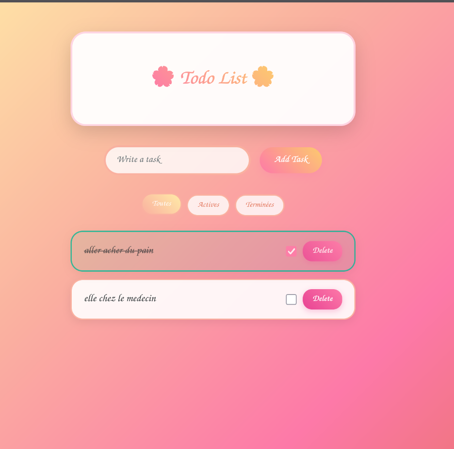
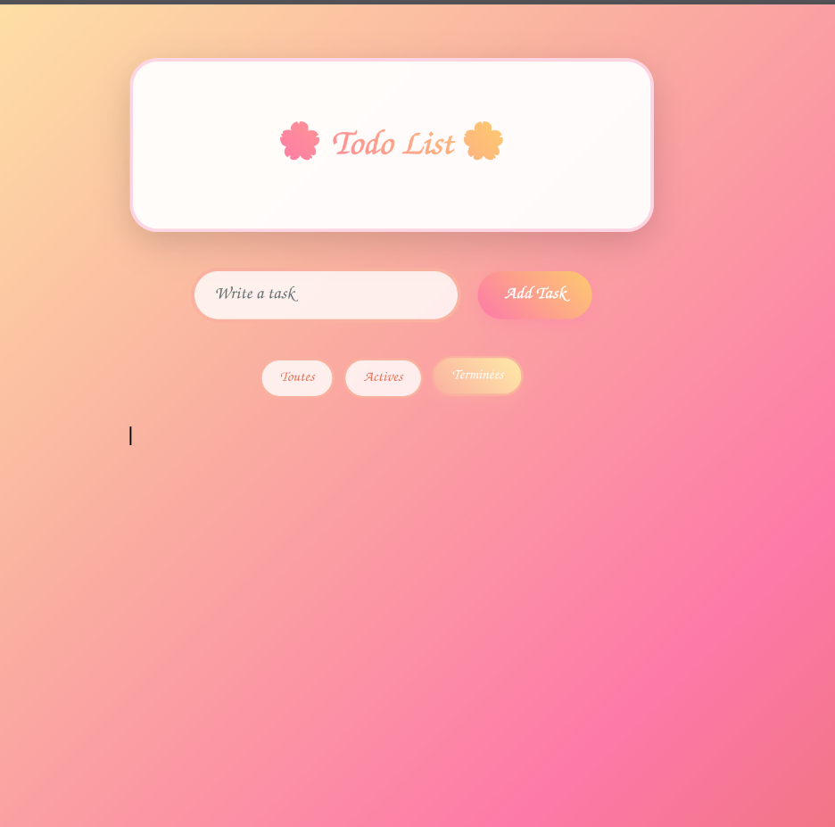

# 🌸 Cute Todo List 🌸

Une application Todo List en React avec une **interface girly/pastel**, parfaite pour s'organiser avec style ✨

## 💖 Aperçu

### 🌼 Mode principal


### 📱 Version responsive


---

## 🚀 Fonctions principales

- ✅ Ajouter / cocher / supprimer des tâches
- 🌸 Filtrer par tâches : Toutes, Actives, Terminées
- 💅 Interface kawaii, pastel & responsive
- 🎨 Design avec CSS personnalisé

---

## 🛠️ Technologies

- React 18 + Vite
- CSS personnalisé (pas de framework)
- Composants fonctionnels avec `useState`

---

## 📦 Installation locale

```bash
git clone https://github.com/ton-pseudo/Todolist.git
cd todo-app
npm install
npm run dev
